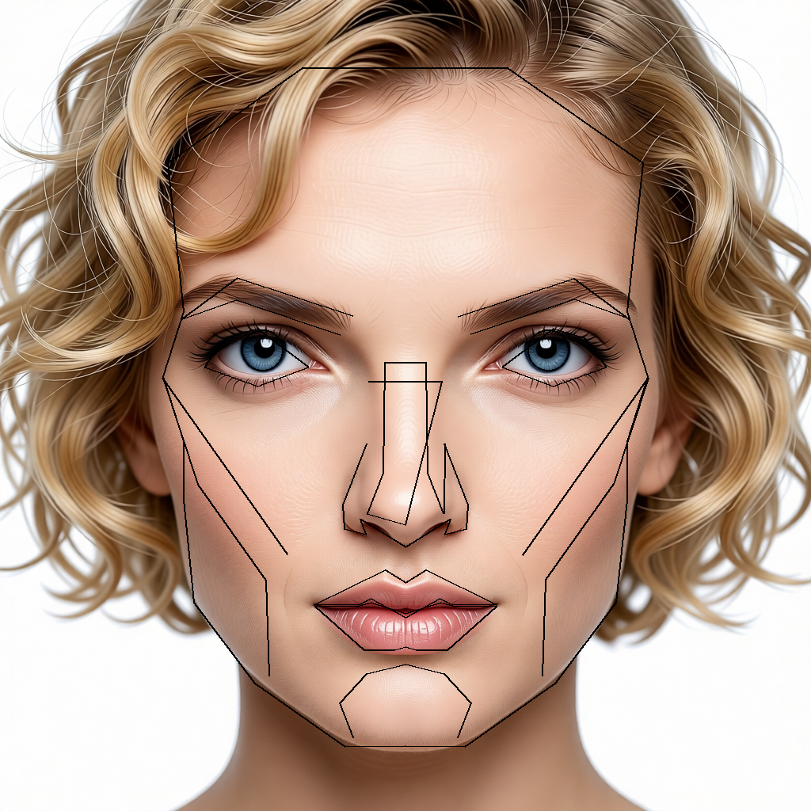
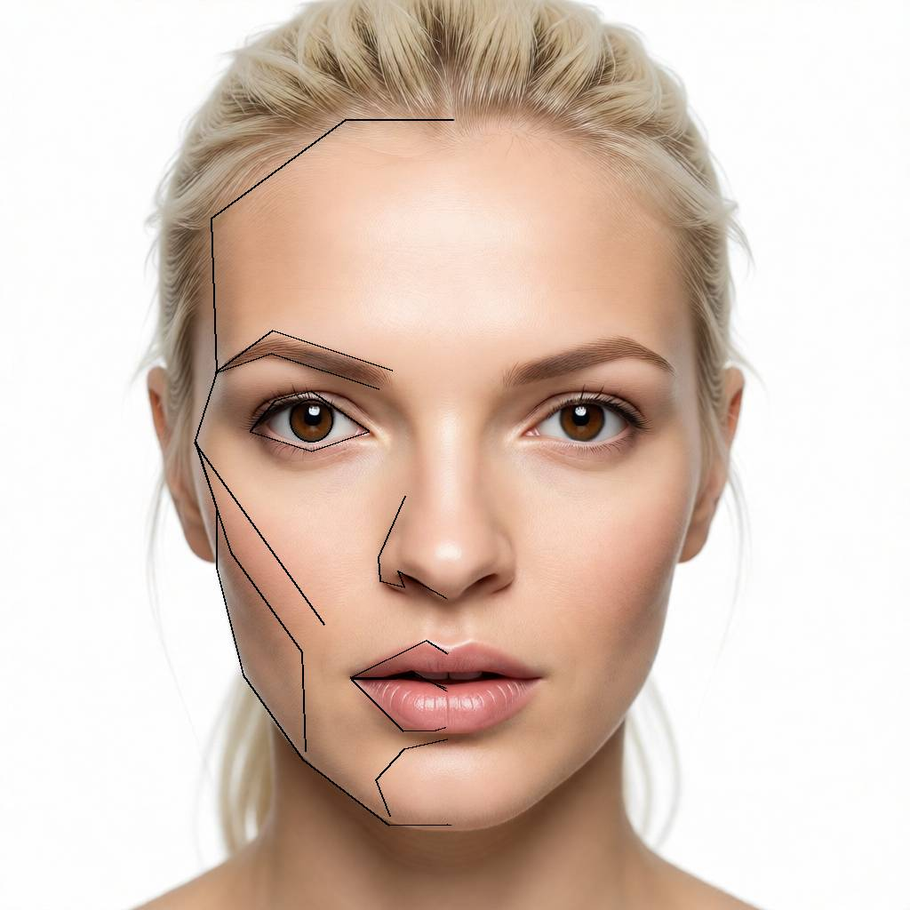
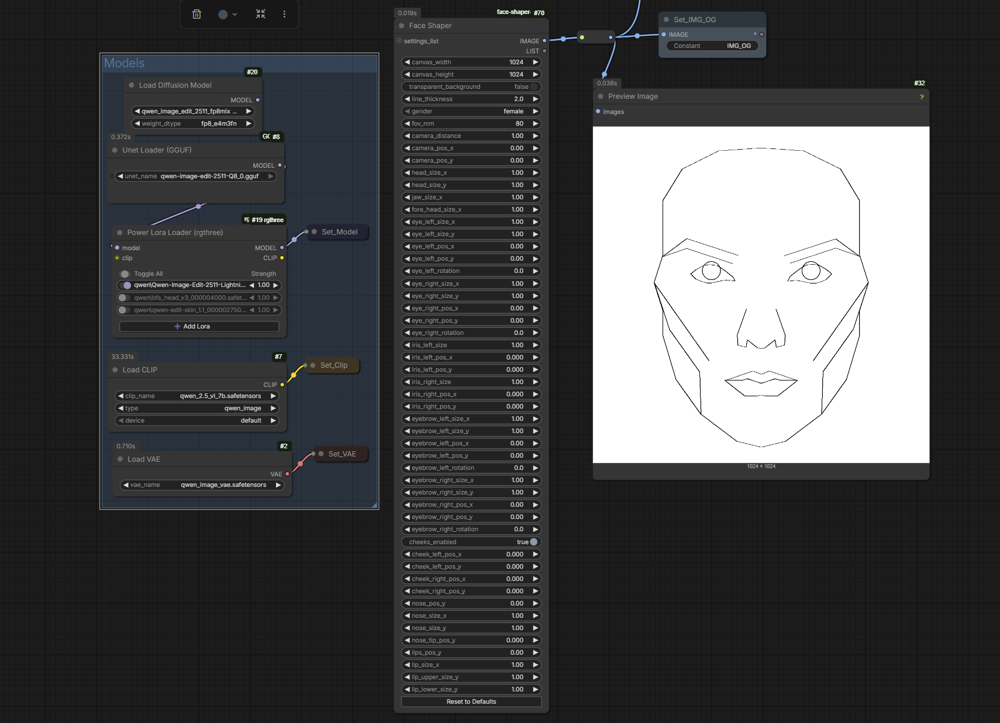

# ComfyUI-face-shaper

A custom ComfyUI node that draws a parametric facial mask with black lines on either a white or transparent background. The node provides extensive control over individual facial features including outer head outline (with separate jaw and forehead controls), eyes (with independent rotation), irises, eyebrows, nose (single merged object), lips (upper and lower with direction-specific scaling), and cheeks. AT THE MOMENT IT WORKS ONLY WITH QWEN-IMAGE-EDIT-2511.






## Installation

1. Clone or download this repository into your `ComfyUI/custom_nodes/` directory:
   ```bash
   cd ComfyUI/custom_nodes/
   git clone https://github.com/EricRorich/ComfyUI-face-shaper.git
   ```

2. Restart ComfyUI. The node will appear under the `face` category as **Face Shaper**.

## Node Parameters

All parameters are exposed under the **required** section:

### Canvas Settings
| Parameter | Type | Default | Range | Description |
|-----------|------|---------|-------|-------------|
| `canvas_width` | INT | 1024 | 256–2048 | Output width in pixels |
| `canvas_height` | INT | 1024 | 256–2048 | Output height in pixels |
| `gender` | ENUM | `female` | `female`/`male` | Gender preset (male currently uses female data) |
| `transparent_background` | BOOLEAN | `false` | `true`/`false` | Use transparent background instead of white |

### Eye Controls
| Parameter | Type | Default | Range | Description |
|-----------|------|---------|-------|-------------|
| `eye_left_size_x` | FLOAT | 1.0 | 0.5–2.0 | Scale left eye width |
| `eye_left_size_y` | FLOAT | 1.0 | 0.5–2.0 | Scale left eye height |
| `eye_left_pos_x` | FLOAT | 0.0 | -0.5–0.5 | Translate left eye horizontally |
| `eye_left_pos_y` | FLOAT | 0.0 | -0.5–0.5 | Translate left eye vertically |
| `eye_left_rotation` | FLOAT | 0.0 | -45.0–45.0 | Rotate left eye around its centroid (degrees) |
| `eye_right_size_x` | FLOAT | 1.0 | 0.5–2.0 | Scale right eye width |
| `eye_right_size_y` | FLOAT | 1.0 | 0.5–2.0 | Scale right eye height |
| `eye_right_pos_x` | FLOAT | 0.0 | -0.5–0.5 | Translate right eye horizontally |
| `eye_right_pos_y` | FLOAT | 0.0 | -0.5–0.5 | Translate right eye vertically |
| `eye_right_rotation` | FLOAT | 0.0 | -45.0–45.0 | Rotate right eye around its centroid (degrees) |

### Iris Controls (Separated)
| Parameter | Type | Default | Range | Description |
|-----------|------|---------|-------|-------------|
| `iris_left_size` | FLOAT | 1.0 | 0.5–2.0 | Scale left iris radius |
| `iris_left_pos_x` | FLOAT | 0.0 | -0.5–0.5 | Translate left iris horizontally |
| `iris_left_pos_y` | FLOAT | 0.0 | -0.5–0.5 | Translate left iris vertically |
| `iris_right_size` | FLOAT | 1.0 | 0.5–2.0 | Scale right iris radius |
| `iris_right_pos_x` | FLOAT | 0.0 | -0.5–0.5 | Translate right iris horizontally |
| `iris_right_pos_y` | FLOAT | 0.0 | -0.5–0.5 | Translate right iris vertically |

### Outer Head Outline Controls
| Parameter | Type | Default | Range | Description |
|-----------|------|---------|-------|-------------|
| `outer_head_size_x` | FLOAT | 1.0 | 0.5–2.0 | Scale mid-face width (0.3 ≤ y ≤ 0.7) |
| `outer_head_size_y` | FLOAT | 1.0 | 0.5–2.0 | Scale outer head height |
| `jaw_size_x` | FLOAT | 1.0 | 0.5–2.0 | Scale jaw width (y > 0.7) |
| `forehead_size_x` | FLOAT | 1.0 | 0.5–2.0 | Scale forehead width (y < 0.3) |

### Lips Controls
| Parameter | Type | Default | Range | Description |
|-----------|------|---------|-------|-------------|
| `lips_pos_y` | FLOAT | 0.0 | -0.5–0.5 | Translate both lips vertically (shared) |
| `lips_size_x` | FLOAT | 1.0 | 0.5–2.0 | Scale both lips horizontally (shared) |
| `lip_upper_size_y` | FLOAT | 1.0 | 0.5–2.0 | Scale upper lip upward from mouth midline |
| `lip_lower_size_y` | FLOAT | 1.0 | 0.5–2.0 | Scale lower lip downward from mouth midline |

### Eyebrow Controls
| Parameter | Type | Default | Range | Description |
|-----------|------|---------|-------|-------------|
| `eyebrow_left_pos_x` | FLOAT | 0.0 | -0.5–0.5 | Translate left eyebrow horizontally |
| `eyebrow_left_pos_y` | FLOAT | 0.0 | -0.5–0.5 | Translate left eyebrow vertically |
| `eyebrow_right_pos_x` | FLOAT | 0.0 | -0.5–0.5 | Translate right eyebrow horizontally |
| `eyebrow_right_pos_y` | FLOAT | 0.0 | -0.5–0.5 | Translate right eyebrow vertically |

### Nose Controls
| Parameter | Type | Default | Range | Description |
|-----------|------|---------|-------|-------------|
| `nose_pos_y` | FLOAT | 0.0 | -0.5–0.5 | Translate nose vertically |
| `nose_size_x` | FLOAT | 1.0 | 0.5–2.0 | Scale nose width |
| `nose_size_y` | FLOAT | 1.0 | 0.5–2.0 | Scale nose height |

### Global Controls
| Parameter | Type | Default | Range | Description |
|-----------|------|---------|-------|-------------|
| `camera_distance` | FLOAT | 1.0 | 0.5–2.0 | Global zoom factor for all features |
| `line_thickness` | FLOAT | 2.0 | 0.5–10.0 | Stroke width for all lines |

## Output

The node outputs a single `IMAGE` tensor with shape `[1, H, W, C]`, featuring:
- **White or transparent background** (RGB 255,255,255 or RGBA 255,255,255,0 depending on `transparent_background` setting)
- **Black line drawings** (RGB/RGBA 0,0,0 with full opacity)
- **Float32 format** normalized to 0.0-1.0 range
- **3 channels (RGB)** when `transparent_background` is false
- **4 channels (RGBA)** when `transparent_background` is true

This output can be used as:
- Conditioning input for other nodes
- Masking or guide images
- Base for further image processing in ComfyUI workflows
- Alpha-aware compositing when using transparent background

## Usage Example

1. Add the **Face Shaper** node from the `face` category
2. Connect the output to any node that accepts IMAGE tensors
3. Adjust parameters to customize the facial features:
   - Enable `transparent_background` for RGBA output with alpha channel
   - Increase `iris_left_size` and `iris_right_size` for larger irises
   - Adjust `eyebrow_left_pos_y` and `eyebrow_right_pos_y` to raise/lower eyebrows
   - Use `eye_left_rotation` and `eye_right_rotation` to rotate eyes independently (useful for expression control)
   - Use `lips_size_x` to scale both lips horizontally together
   - Use `lip_upper_size_y` to make the upper lip fuller (scales upward from mouth midline)
   - Use `lip_lower_size_y` to adjust the lower lip (scales downward from mouth midline)
   - Adjust `nose_pos_y`, `nose_size_x`, and `nose_size_y` for nose adjustments
   - Adjust `outer_head_size_x` and `outer_head_size_y` for different head shapes
   - Use `jaw_size_x` to widen or narrow the jaw region
   - Use `forehead_size_x` to adjust the forehead width independently
   - Adjust `lips_pos_y` to move both lips up or down together

## Coordinate System

All position parameters use a relative coordinate system:
- **0.0** = center position (no translation)
- **Positive values** = move right (x) or down (y)
- **Negative values** = move left (x) or up (y)
- Position values are fractions of canvas dimensions

All size parameters are multipliers:
- **1.0** = original size
- **< 1.0** = smaller
- **> 1.0** = larger

## Technical Details

- **Coordinate extraction**: All paths extracted from Face_Mask_female.svg with viewBox (270.93331×270.93331) and coordinates normalized to [0-1] range
- **Recent coordinate updates**: 
  - Eyes updated with new geometry from SVG paths (path190/path188) with 16 points each for more realistic shape
  - Nose geometry updated to 13 points (from path46)
  - Lips naming corrected to match visual positions
  - Chin geometry completely removed from the node
- **Eye rotation**: Independent rotation controls for each eye, rotating around the eye's centroid
- **Coordinate transform**: Relative coordinates (0-1 range) are converted to pixel coordinates using: 
  - `x = (rx - 0.5) * canvas_width * camera_distance + canvas_width / 2`
  - `y = (ry - 0.5) * canvas_height * camera_distance + canvas_height / 2`
- **Feature transforms**: Each feature group (eyes, eyebrows, nose, lips, outer_head, etc.) has its own transformation applied before pixel conversion to avoid cross-feature distortion
- **Drawing method**: Uses PIL (Pillow) to draw polylines and circles, then converts to PyTorch tensor
- **Per-feature scaling**: Scaling parameters are scoped to their respective features only

## Facial Features Included

The node renders distinct SVG paths organized into feature groups:

1. **Outer head** (21 points, closed) - Full face outline contour with per-region horizontal scaling (jaw, mid-face, forehead)
2. **Cheeks** (left: 4 points, right: 4 points) - Cheek contours with automatic connections to outer head
3. **Lips** (2 closed shapes: upper: 11 points, lower: 13 points) - Mouth/lips area with direction-specific scaling
4. **Eyes** (left: 16 points closed, right: 16 points closed) - Eye outlines with independent rotation controls
5. **Irises** (left: circle, right: circle) - Pupil/iris circles
6. **Eyebrows** (left: 5 points, right: 5 points) - Eyebrow curves with rotation controls
7. **Nose** (13 points) - Single merged nose object updated from latest SVG

## Future Improvements

- [ ] Add dedicated male coordinate data (currently uses female coordinates for both genders)
- [ ] Add more granular control over additional facial features
- [ ] Animation support with keyframe interpolation
- [ ] Export/import custom face templates


## Requirements

- ComfyUI
- Python packages (typically included with ComfyUI):
  - `torch`
  - `numpy`
  - `PIL` (Pillow)

## License

This project follows the same license as ComfyUI.

## Credits

Coordinates derived from Face_Mask_female.svg template (1024×1024). This is a custom node implementation for the ComfyUI framework.
